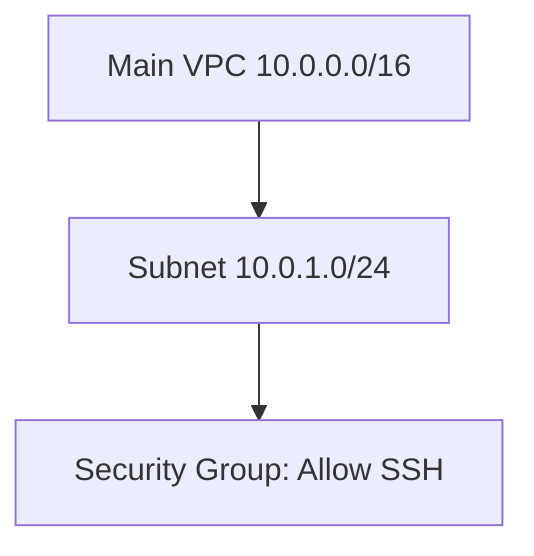

*Imagine being able to build your entire cloud infrastructure just by running a few commands—no manual clicking, no surprises. That’s Terraform in action! In this blog, we’ll treat IaC like a series of fun experiments.*

---

## What is Terraform?

Terraform is an **open-source Infrastructure as Code (IaC) tool** developed by HashiCorp. It allows you to **define, provision, and manage cloud infrastructure using code**, rather than manually clicking through cloud consoles.  

With Terraform, you can:  
- **Create and manage cloud resources** like VMs, networks, databases, and load balancers.  
- **Automate infrastructure provisioning** across multiple cloud providers (AWS, Azure, GCP, etc.).  
- **Version control your infrastructure** using Git, just like you would with software code.  
- **Reuse configurations** through modules for consistent deployments.  

> Think of Terraform as a blueprint for your cloud infrastructure—write it once, apply it anywhere, and repeat reliably.

---

## Why Use Terraform?

1. **Consistency:** No more manual setup mistakes.  
2. **Automation:** Provision and tear down environments automatically.  
3. **Collaboration:** Teams can work together on infrastructure code using version control.  
4. **Scalability:** Easily manage hundreds of resources across multiple environments.  

---

## Prerequisites

1. **Install Terraform** – Download and install Terraform from the [official website](https://www.terraform.io/downloads).  
2. **Basic AWS Knowledge** – Familiarity with aws CLI, EC2
3. **Configure AWS Credentials** – Ensure your AWS CLI is installed and configured using `aws configure`. Check credentials with:

```bash
cat ~/.aws/credentials
```

## 🧪 Lab Notebook: Experiment 1 — Provision Your First Server

**Objective:** Launch a simple EC2 instance using Terraform.

**Terraform Configuration:**

```hcl
provider "aws" {
  region = "us-east-1"
}

resource "aws_instance" "my_first_server" {
  ami           = "ami-0c94855ba95c71c99"  # Example Ubuntu AMI
  instance_type = "t2.micro"

  tags = {
    Name = "MyFirstServer"
  }
}
```
## Experiment 2 — Networking Made Simple

```
# networking.tf
resource "aws_vpc" "main_vpc" {
  cidr_block = "10.0.0.0/16"
  tags = { Name = "MainVPC" }
}

resource "aws_subnet" "main_subnet" {
  vpc_id     = aws_vpc.main_vpc.id
  cidr_block = "10.0.1.0/24"
  tags = { Name = "MainSubnet" }
}

resource "aws_security_group" "allow_ssh" {
  name   = "allow_ssh"
  vpc_id = aws_vpc.main_vpc.id

  ingress {
    from_port   = 22
    to_port     = 22
    protocol    = "tcp"
    cidr_blocks = ["0.0.0.0/0"]
  }
}
```


## Terraform Commands
```
terraform init   # Initialize the project
terraform plan   # Preview changes
terraform apply  # Apply configuration
terraform destroy # Optional: clean up resources
```

## Lab Tips:
Always run terraform plan to preview changes before applying.

Use terraform destroy to clean up resources and avoid extra costs.

Always tag your resources for better organization. 

## Terraform workflow

